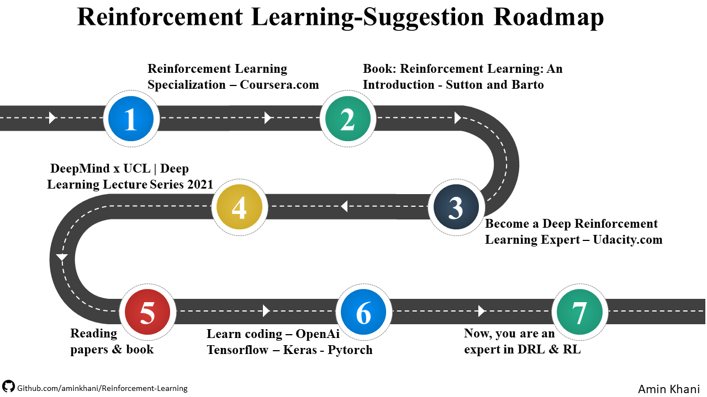
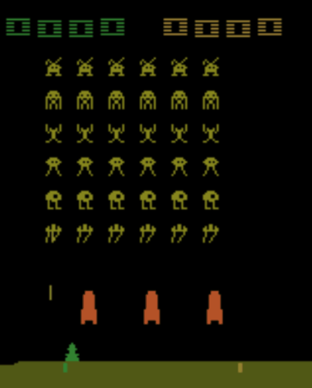
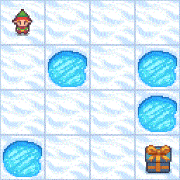
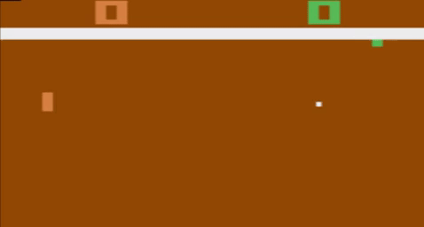

<div align="center">
  <br><br>
  <a href="https://www.linkedin.com/in/aminkhani-ai/" targert="_blacnk">
    
  <a href="mailto:aminkhani2010@gmail.com" targert="_blacnk">
    
  </a>
  <a href="https://t.me/aminkhani_ai" targert="_blacnk">
    
  </a>  
  <a href="https://www.instagram.com/aminkhani_ai/" targert="_blacnk">
    
  </a>
  <a href="https://github.com/aminkhani/" targert="_blacnk">
    
  </a>
</div>
<br />
<div align="center">
  <h1 align="center">Reinforcement learning</h1>
  <p align="center">
    <h3>A reference for <strong>Books</strong>, <strong>Articles</strong>, <strong>Courses</strong> and <strong>Educational Materials</strong> in this field</h3>
    <br />
    <br />
    <a href="https://github.com/aminkhani/Reinforcement-Learning#world_maproadmap">🗺️Roadmap</a> 
    .
    <a href="https://github.com/aminkhani/Reinforcement-Learning#books-books">📚Books</a>
    ·
    <a href="https://github.com/aminkhani/Reinforcement-Learning#page_facing_up-articles">📄Articles</a>
    ·
    <a href="https://github.com/aminkhani/Reinforcement-Learning#mortar_board-courses">🎓Courses</a>
    .
    <a href="https://github.com/aminkhani/Reinforcement-Learning#computer-blogs">💻Blogs</a>
    .
    <a href="https://github.com/aminkhani/Reinforcement-Learning#gear-projects">⚙️Projects</a>
    <p align="center"><br>
   <a href="https://github.com/aminkhani/Reinforcement-Learning/issues/new?assignees=&labels=bug&template=bug_report.yml&title=%5BBUG%5D%3A+">🐛Report Bug</a>
   .
   <a href="https://github.com/aminkhani/Reinforcement-Learning/issues/new?assignees=&labels=question&template=question.yml&title=%5BQUESTION%5D%3A+">❓Ask Question</a>
   .
  <a href="https://github.com/aminkhani/Reinforcement-Learning/issues/new?assignees=&labels=like&template=like.yml&title=%5BLIKE%5D%3A+">👍Like the repo</a>
  .
  <a href="https://github.com/aminkhani/Reinforcement-Learning/issues/new?assignees=&labels=unlike&template=unlike.yml&title=%5BUNLIKE%5D%3A+">👎Dislike the repo</a>
  </p>
  </p>
</div><br /><br />

</div><br /><br />

> **Note**
> 
> :white_check_mark::100: it means, I have seen and tried them, I definitely recommend them to you

## What is Reinforcement Learning(RL)?
Reinforcement learning (RL) is a field of machine learning concerned with how intelligent agents ought to take actions in an environment in order to maximize the notion of cumulative reward. Reinforcement learning is one of three basic machine learning paradigms, alongside supervised learning and unsupervised learning.

> You can also read below blog to understand the key concepts in Reinforcement Learning
>> :link: https://medium.com/intro-to-artificial-intelligence/key-concepts-in-reinforcement-learning-2af715dfbfa

<br />

# :world_map:Roadmap
> **Warning**
> This is only a segguestion roadmap
<div align="center">

</div><br>
<div align="right"><a href="https://github.com/aminkhani/Reinforcement-Learning#reinforcement-learning" targert="_blacnk"></a></div>

# :books: Books

``` 1. The main and reference of most books and articles ```
* :white_check_mark::100:Reinforcement Learning: An Introduction - Second Edition - Richard S. Sutton and Andrew G. Barto
> <a href="https://s3-us-west-1.amazonaws.com/udacity-drlnd/bookdraft2018.pdf" targert="_blacnk"></a>

``` 2. Deep Reinforcement Learning ```
* Deep Reinforcement Learning with Python - Second Edition - Sudharsan Ravichandiran
> <a href="https://www.packtpub.com/product/deep-reinforcement-learning-with-python-second-edition/9781839210686" targert="_blacnk"></a>

* Grokking Deep Reinforcement Learning - Miguel Morales
> <a href="https://www.manning.com/books/grokking-deep-reinforcement-learning" targert="_blacnk"></a>

<div align="right"><a href="https://github.com/aminkhani/Reinforcement-Learning#reinforcement-learning" targert="_blacnk"></a></div>

# :page_facing_up: Articles
> ### Sort by Time

```bash
1992 May: Watkins, C.J.C.H., Dayan, P. "Q-learning". Mach Learn 8, 279–292 (1992) 
```
> <a href="https://link.springer.com/content/pdf/10.1007/BF00992698.pdf" targert="_blacnk"></a>

```bash
1995 Mar: Gerald Tesauro. "Temporal Difference Learning and TD-Gammon."
```
> <a href="https://www.bkgm.com/articles/tesauro/tdl.html" targert="_blacnk"></a>

```bash
2005 Oct: Riedmiller, Martin. "Neural fitted Q iteration–first experiences with a data efficient neural reinforcement learning method." 
```
> <a href="https://link.springer.com/content/pdf/10.1007/11564096_32.pdf" targert="_blacnk"></a>

```bash 
2013 Dec: Volodymyr Mnih, et al. "Playing Atari with Deep Reinforcement Learning." 
```
> <a href="https://www.cs.toronto.edu/~vmnih/docs/dqn.pdf" targert="_blacnk"></a>

```bash
2015 Feb: Mnih, Volodymyr, et al. "Human-level control through deep reinforcement learning."
```
> <a href="http://www.davidqiu.com:8888/research/nature14236.pdf" targert="_blacnk"></a>

```bash
2015 Feb: Bernhard Schölkopf. "Learning to see and act." Nature518, pages486–487 (2015)
```
> <a href="https://www.cs.swarthmore.edu/~meeden/cs63/s15/nature15a.pdf" targert="_blacnk"></a>

```bash
2015 Sep: Hado van Hasselt, et al. "Deep Reinforcement Learning with Double Q-learning." 
```
> <a href="https://arxiv.org/pdf/1509.06461.pdf" targert="_blacnk"></a>

```bash
2015 Nov: Ziyu Wang, et al. "Dueling Network Architectures for Deep Reinforcement Learning." 
```
> <a href="https://arxiv.org/pdf/1511.06581.pdf" targert="_blacnk"></a>

```bash
2016 Jan: David Silver, et al. "Mastering the game of Go with deep neural networks and tree search."
```
> <a href="https://storage.googleapis.com/deepmind-media/alphago/AlphaGoNaturePaper.pdf" targert="_blacnk"></a>

```bash
2016 Jun: Brockman, Greg, et al. "Openai gym." arXiv preprint arXiv:1606.01540. 
```
> <a href="https://arxiv.org/pdf/1606.01540.pdf" targert="_blacnk"></a>

```bash
2016 Feb: Volodymyr Mnih, et al. "Asynchronous Methods for Deep Reinforcement Learning." 
```
> <a href="https://arxiv.org/pdf/1602.01783.pdf" targert="_blacnk"></a>

```bash
2017 Aug: Schulman, John, et al. "Proximal policy optimization algorithms." 
```
> <a href="https://arxiv.org/pdf/1707.06347.pdf" targert="_blacnk"></a>

```bash
2020 Oct: Xing Wua, et al. "Adaptive stock trading strategies with deep reinforcement learning methods."
```
> <a href="https://doi.org/10.1016/j.ins.2020.05.066" targert="_blacnk"></a>


<div align="right"><a href="https://github.com/aminkhani/Reinforcement-Learning#reinforcement-learning" targert="_blacnk"></a></div>

# :mortar_board: Courses

``` 1. Reinforcement Learning Specialization ``` 
> Master the Concepts of Reinforcement Learning. Implement a complete RL solution and understand how to apply AI tools to solve real-world problems.
* Offered By UNIVERSITY OF ALBERTA ALBERTA MACHINE INTELLIGENCE INSTITUTE
* There are 4 Courses in this Specialization
  - <a href="https://www.coursera.org/learn/fundamentals-of-reinforcement-learning?specialization=reinforcement-learning" taget="_blank">:white_check_mark::100:Fundamentals of Reinforcement Learning</a>
  - <a href="https://www.coursera.org/learn/sample-based-learning-methods?specialization=reinforcement-learning" taget="_blank">:white_check_mark::100:Sample-based Learning Methods</a>
  - <a href="https://www.coursera.org/learn/prediction-control-function-approximation?specialization=reinforcement-learning" taget="_blank">:white_check_mark::100:Prediction and Control with Function Approximation</a>
  - <a href="https://www.coursera.org/learn/complete-reinforcement-learning-system?specialization=reinforcement-learning" taget="_blank">:white_check_mark::100:A Complete Reinforcement Learning System (Capstone)</a>
> <a href="https://www.coursera.org/specializations/reinforcement-learning" targert="_blacnk"></a>

``` 2. Become a Deep Reinforcement Learning Expert ``` 
> Learn the deep reinforcement learning skills that are powering amazing advances in AI. Then start applying these to applications like video games and robotics.
* :white_check_mark::100:Presented by UDACITY - Nanodegree Program 
> <a href="https://www.udacity.com/course/deep-reinforcement-learning-nanodegree--nd893" targert="_blacnk"></a>

``` 3. DeepMind x UCL | Deep Learning Lecture Series 2021 ``` 
> The Deep Learning Lecture Series is a collaboration between DeepMind and the UCL Centre for Artificial Intelligence.
* :white_check_mark::100:Presented by DeepMind & UCL
> <a href="https://www.youtube.com/playlist?list=PLqYmG7hTraZDVH599EItlEWsUOsJbAodm" targert="_blacnk"></a>

``` 4. Advanced AI: Deep Reinforcement Learning in Python ``` 
> Created by Lazy Programmer Team, Lazy Programmer Inc.
* The Complete Guide to Mastering Artificial Intelligence using Deep Learning and Neural Networks
> <a href="https://www.udemy.com/course/deep-reinforcement-learning-in-python/" targert="_blacnk"></a>

<div align="right"><a href="https://github.com/aminkhani/Reinforcement-Learning#reinforcement-learning" targert="_blacnk"></a></div>

# :computer: Blogs

* ### Deep Reinforcement Learning
  <a href="https://www.freecodecamp.org/news/an-introduction-to-deep-q-learning-lets-play-doom-54d02d8017d8">:link: An introduction to Deep Q-Learning: let’s play Doom</a><br>
  <a href="https://karpathy.github.io/2016/05/31/rl/">:link: Deep Reinforcement Learning: Pong from Pixels</a> :white_check_mark::100:```Andrej Karpathy blog ```<br>

* ### Value-Based Methods
  <a href="https://medium.com/intro-to-artificial-intelligence/q-learning-a-value-based-reinforcement-learning-algorithm-272706d835cf">:link: Q-learning: a value-based reinforcement learning algorithm</a><br>
  <a href="https://medium.com/intro-to-artificial-intelligence/deep-q-network-dqn-applying-neural-network-as-a-functional-approximation-in-q-learning-6ffe3b0a9062">:link: Deep Q Network(DQN)- Applying Neural Network as a functional approximation in Q-learning</a><br>
  <a href="https://www.freecodecamp.org/news/diving-deeper-into-reinforcement-learning-with-q-learning-c18d0db58efe">:link: Diving deeper into Reinforcement Learning with Q-Learning</a><br>
  
* ### Policy-Based Methods
  <a href="https://medium.com/intro-to-artificial-intelligence/reinforce-a-policy-gradient-based-reinforcement-learning-algorithm-84bde440c816">:link: REINFORCE — a policy-gradient based reinforcement Learning algorithm</a><br>
  <a href="https://towardsdatascience.com/policy-based-reinforcement-learning-the-easy-way-8de9a3356083">:link: Policy Based Reinforcement Learning, the Easy Way</a><br>
  <a href="https://towardsdatascience.com/revisiting-policy-in-reinforcement-learning-for-developers-43cd2b713182">:link: Reinforcement Learning Policy for Developers<a><br>
  <a href="https://www.freecodecamp.org/news/an-introduction-to-policy-gradients-with-cartpole-and-doom-495b5ef2207f/">:link: An introduction to Policy Gradients with Cartpole and Doom</a><br>

* ### Value & Policy Based Methods
  <a href="https://towardsdatascience.com/introduction-to-actor-critic-7642bdb2b3d2">:link: Introduction to Actor Critic in Reinforcement Learning</a><br>
  <a href="https://medium.com/intro-to-artificial-intelligence/the-actor-critic-reinforcement-learning-algorithm-c8095a655c14">:link: The Actor-Critic Reinforcement Learning algorithm</a><br>


* ### Relevant & Attractive Content
  <a href="https://www.technologyreview.com/2016/03/18/161519/this-factory-robot-learns-a-new-job-overnight/" target="_blanck">:link: This   Factory Robot Learns a New Job Overnight</a><br>
  <a href="https://jonathan-hui.medium.com/rl-basics-algorithms-and-terms-ae98314851d7">:link: RL — Basics algorithms and terms</a><br>
  <a href="https://towardsdatascience.com/the-complete-reinforcement-learning-dictionary-e16230b7d24e">:link: The Complete Reinforcement Learning Dictionary</a><br>

<div  align="right"><a href="https://github.com/aminkhani/Reinforcement-Learning#reinforcement-learning" targert="_blacnk"></a></div>

# :gear: Projects
  ### ``` 1- Space Invader ```
  
  
  > **Note** 
  > In this environment, the observation is an RGB image of the screen, which is an array of shape (210, 160, 3) Each action is repeatedly performed for a duration of k frames, where k is uniformly sampled from {2, 3, 4}. Our Target is to maximize our score.
  
  <a href="Space-Invader/DQN/" targert="_blacnk"></a> <a href="Space-Invader/DDQN/" targert="_blacnk"></a> <a href="Space-Invader/PG/" targert="_blacnk"></a>
  
  ### ``` 2- Frozen Lake ```
  
  
  > **Note**
  > Frozen lake involves crossing a frozen lake from Start(S) to Goal(G) without falling into any Holes(H) by walking over the Frozen(F) lake. The agent may not always move in the intended direction due to the slippery nature of the frozen lake.
  
  <a href="Frozen-Lake/Q-Learning/" targert="_blacnk"></a>
  
  ### ``` 3- Ping Pong ```
  
  
  > **Note** 
  
  <a href="" targert="_blacnk"></a>

<div  align="right"><a href="https://github.com/aminkhani/Reinforcement-Learning#reinforcement-learning" targert="_blacnk"></a></div>
