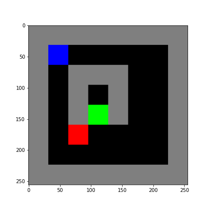

```python
import copy
import sys 
import numpy as np
import gym # gym version: 0.21.0
from collections import defaultdict
import matplotlib.pyplot as plt
```


```python
# Grid cell state and color mapping
EMPTY = BLACK = 0
WALL = GRAY = 1
AGENT = BLUE = 2
BOMB = RED = 3
GOAL = GREEN = 4
```


```python
# RGB color value table
COLOR_MAP = {
    BLACK : [0.0, 0.0, 0.0],
    GRAY : [0.5, 0.5, 0.5],
    BLUE : [0.0, 0.0, 1.0],
    RED : [1.0, 0.0, 0.0],
    GREEN : [0.0, 1.0, 0.0]
}
```


```python
# Action mapping
NOOP = 0
DOWN = 1
UP = 2
LEFT = 3
RIGHT= 4
```


```python
class GridWorldEnv(gym.Env):
    def __init__(self, max_steps=100) -> None:
        """Initialize Gridworld

        Args:
            max_steps (int, optional): Max steps per episode. Defaults to 100.
        """
        # Observations
        self.grid_layout = """
        1 1 1 1 1 1 1 1
        1 2 0 0 0 0 0 1
        1 0 1 1 1 0 0 1
        1 0 1 0 1 0 0 1
        1 0 1 4 1 0 0 1
        1 0 3 0 0 0 0 1
        1 0 0 0 0 0 0 1
        1 1 1 1 1 1 1 1 
        """
        self.initial_grid_state = np.fromstring(self.grid_layout, dtype=int, sep=" ")
        self.initial_grid_state = self.initial_grid_state.reshape(8, 8)
        self.grid_state = copy.deepcopy(self.initial_grid_state)
        self.observation_space = gym.spaces.Box(low=0, high=6, shape=self.grid_state.shape)
        self.img_shape = [256, 256, 3]
        self.metadata = {"renfer.mode" : ["human"]}
        # Actions
        self.action_space = gym.spaces.Discrete(5)
        self.actios = [NOOP, DOWN, UP, LEFT, RIGHT]
        self.action_pos_dict = defaultdict(
            lambda : [0, 0],
            {
                NOOP: [0, 0],
                UP: [-1, 0],
                DOWN: [1, 0],
                LEFT: [0, -1],
                RIGHT: [0, 1],
            }
        )
        (self.agent_state, self.goal_state) = self.get_state()
        self.step_num = 0  # To keep track of number of steps
        self.max_steps = max_steps
        self.done = False
        self.info = {"status": "Live"}
        self.viewer = None
    def get_state(self):
        start_state = np.where(self.grid_state == AGENT)
        goal_state = np.where(self.grid_state == GOAL)

        start_or_gloal_not_found = not (start_state[0] and goal_state[0])
        if start_or_gloal_not_found:
            sys.exit(
                "Start and/or Goal state not present in the Gridworld. "
                "Check the Grid layout"
            )
        start_state = (start_state[0][0], start_state[1][0])
        goal_state = (goal_state[0][0], goal_state[1][0])
        return start_state, goal_state

    def step(self, action):
        """Return next observation, reward, done, info"""
        action = int(action)
        reward = 0.0

        next_state = (
            self.agent_state[0] + self.action_pos_dict[action][0],
            self.agent_state[1] + self.action_pos_dict[action][1]
        )
        next_state_invalid = ((next_state[0] < 0 or next_state[0] >= self.grid_state.shape[0]) or
                             (next_state[1] < 1 or next_state[1] >= self.grid_state.shape[1]))
        if next_state_invalid: 
            # Leave the agent state unchanged
            next_state = self.agent_state
            self.info["status"] = "Next state is invalid"

        next_agent_state = self.grid_state[next_state[0], next_state[1]]

        # Calculate Reward
        if next_agent_state == EMPTY:
            # Move agent from previous state to new state on the grid
            self.info["status"] = "Agent move to a new cell"
            self.grid_state[next_state[0], next_state[1]] = AGENT
            self.grid_state[self.agent_state[0], self.agent_state[1]] = EMPTY
            self.agent_state = copy.deepcopy(next_state)

        elif next_agent_state == WALL:
            self.info['status'] = "Agent bumped into a wall"
            reward = -1
        # Terminal state
        elif next_agent_state == GOAL:
            self.info['status'] = "Agent reached the GOAL"
            self.done = True
            reward = +1
        elif next_agent_state == BOMB:
            self.info['status'] = 'Agent stepped on a BOMB'
            self.done = True
            reward = -1
        # elif next_agent_state == AGENT:
        else:
            # NOOP or next state is invalid
            self.done = False

        self.step_num += 1

        # Check if max steps per episode has been reached
        if self.step_num > self.max_steps:
            self.done = True
            self.info['status'] = 'Max steps reached'

        if self.done:
            done = True
            terminal_state = copy.deepcopy(self.grid_state)
            terminal_info = copy.deepcopy(self.info)
            _ = self.reset()
            return (terminal_state, reward, done, terminal_info)

        return self.grid_state, reward, self.done, self.info   

    def reset(self):
        self.grid_state = copy.deepcopy(self.initial_grid_state)
        (self.agent_state, self.goal_state) = self.get_state()
        self.step_num = 0
        self.done = False
        self.info["status"] = "Live"
        return self.grid_state

    def gridarray_to_image(self, img_shape=None):
        if img_shape is None:
            img_shape = self.img_shape
        observation = np.random.randn(*img_shape) * 0.0
        scale_x = int(observation.shape[0] / self.grid_state.shape[0])
        scale_y = int(observation.shape[1] / self.grid_state.shape[1])
        for i in range(self.grid_state.shape[0]):
            for j in range(self.grid_state.shape[1]):
                for k in range(3):  # 3-channel RGB image
                    pixel_value = COLOR_MAP[self.grid_state[i, j]][k]
                    observation[
                        i * scale_x : (i + 1) * scale_x,
                        j * scale_y : (j + 1) * scale_y,
                        k,
                    ] = pixel_value
        return (255 * observation).astype(np.uint8)

    def render(self, mode="human", close=False):
        if close:
            if self.viewer is not None:
                self.viewer.close()
                self.viewer = None
            return
        img = self.gridarray_to_image()
        if mode == "rgb_array":
            return img
        elif mode == "human":
            from gym.envs.classic_control import rendering
            if self.viewer is None:
                self.viewer = rendering.SimpleImageViewer()
            self.viewer.imshow(img)

    def close(self):
        self.render(close=True)

    @staticmethod
    def get_action_meanings():
        return ["NOOP", "DOWN", "UP", "LEFT", "RIGHT"]
```


```python
env = GridWorldEnv(max_steps=500)
obs = env.reset()
done = False
step_num = 1
# Run one episode
while not done:
    # Sample a random ac?tion from the action space
    action = env.action_space.sample()
    next_obs, reward, done, info = env.step(action)
    print(f"step#:{step_num} reward:{reward} done:{done} info:{info}")
    step_num += 1
    img = env.render(mode='rgb_array')
env.close()
```

    step#:1 reward:0.0 done:False info:{'status': 'Agent move to a new cell'}
    step#:2 reward:0.0 done:False info:{'status': 'Agent move to a new cell'}
    step#:3 reward:-1 done:False info:{'status': 'Agent bumped into a wall'}
    step#:4 reward:0.0 done:False info:{'status': 'Agent move to a new cell'}
    step#:5 reward:-1 done:False info:{'status': 'Agent bumped into a wall'}
    step#:6 reward:0.0 done:False info:{'status': 'Next state is invalid'}
    step#:7 reward:0.0 done:False info:{'status': 'Agent move to a new cell'}
    step#:8 reward:-1 done:False info:{'status': 'Agent bumped into a wall'}
    step#:9 reward:0.0 done:False info:{'status': 'Agent move to a new cell'}
    step#:10 reward:-1 done:False info:{'status': 'Agent bumped into a wall'}
    step#:11 reward:0.0 done:False info:{'status': 'Agent move to a new cell'}
    step#:12 reward:0.0 done:False info:{'status': 'Agent move to a new cell'}
    step#:13 reward:-1 done:False info:{'status': 'Agent bumped into a wall'}
    step#:14 reward:0.0 done:False info:{'status': 'Agent move to a new cell'}
    step#:15 reward:0.0 done:False info:{'status': 'Agent move to a new cell'}
    step#:16 reward:0.0 done:False info:{'status': 'Agent move to a new cell'}
    step#:17 reward:0.0 done:False info:{'status': 'Agent move to a new cell'}
    step#:18 reward:-1 done:False info:{'status': 'Agent bumped into a wall'}
    step#:19 reward:0.0 done:False info:{'status': 'Agent bumped into a wall'}
    step#:20 reward:0.0 done:False info:{'status': 'Agent move to a new cell'}
    step#:21 reward:-1 done:False info:{'status': 'Agent bumped into a wall'}
    step#:22 reward:0.0 done:False info:{'status': 'Agent bumped into a wall'}
    step#:23 reward:0.0 done:False info:{'status': 'Agent move to a new cell'}
    step#:24 reward:-1 done:False info:{'status': 'Agent bumped into a wall'}
    step#:25 reward:0.0 done:False info:{'status': 'Agent move to a new cell'}
    step#:26 reward:-1 done:False info:{'status': 'Agent bumped into a wall'}
    step#:27 reward:-1 done:False info:{'status': 'Agent bumped into a wall'}
    step#:28 reward:0.0 done:False info:{'status': 'Agent move to a new cell'}
    step#:29 reward:-1 done:False info:{'status': 'Agent bumped into a wall'}
    step#:30 reward:-1 done:False info:{'status': 'Agent bumped into a wall'}
    step#:31 reward:-1 done:False info:{'status': 'Agent bumped into a wall'}
    step#:32 reward:-1 done:False info:{'status': 'Agent bumped into a wall'}
    step#:33 reward:-1 done:False info:{'status': 'Agent bumped into a wall'}
    step#:34 reward:-1 done:False info:{'status': 'Agent bumped into a wall'}
    step#:35 reward:0.0 done:False info:{'status': 'Agent move to a new cell'}
    step#:36 reward:0.0 done:False info:{'status': 'Agent move to a new cell'}
    step#:37 reward:-1 done:False info:{'status': 'Agent bumped into a wall'}
    step#:38 reward:-1 done:False info:{'status': 'Agent bumped into a wall'}
    step#:39 reward:0.0 done:False info:{'status': 'Agent move to a new cell'}
    step#:40 reward:-1 done:False info:{'status': 'Agent bumped into a wall'}
    step#:41 reward:0.0 done:False info:{'status': 'Agent move to a new cell'}
    step#:42 reward:0.0 done:False info:{'status': 'Agent move to a new cell'}
    step#:43 reward:0.0 done:False info:{'status': 'Agent move to a new cell'}
    step#:44 reward:0.0 done:False info:{'status': 'Agent move to a new cell'}
    step#:45 reward:0.0 done:False info:{'status': 'Next state is invalid'}
    step#:46 reward:0.0 done:False info:{'status': 'Agent move to a new cell'}
    step#:47 reward:0.0 done:False info:{'status': 'Agent move to a new cell'}
    step#:48 reward:0.0 done:False info:{'status': 'Agent move to a new cell'}
    step#:49 reward:0.0 done:False info:{'status': 'Agent move to a new cell'}
    step#:50 reward:0.0 done:False info:{'status': 'Agent move to a new cell'}
    step#:51 reward:-1 done:False info:{'status': 'Agent bumped into a wall'}
    step#:52 reward:0.0 done:False info:{'status': 'Agent bumped into a wall'}
    step#:53 reward:-1 done:False info:{'status': 'Agent bumped into a wall'}
    step#:54 reward:0.0 done:False info:{'status': 'Agent move to a new cell'}
    step#:55 reward:0.0 done:False info:{'status': 'Next state is invalid'}
    step#:56 reward:-1 done:False info:{'status': 'Agent bumped into a wall'}
    step#:57 reward:-1 done:False info:{'status': 'Agent bumped into a wall'}
    step#:58 reward:-1 done:False info:{'status': 'Agent bumped into a wall'}
    step#:59 reward:0.0 done:False info:{'status': 'Agent move to a new cell'}
    step#:60 reward:-1 done:False info:{'status': 'Agent bumped into a wall'}
    step#:61 reward:-1 done:False info:{'status': 'Agent bumped into a wall'}
    step#:62 reward:-1 done:False info:{'status': 'Agent bumped into a wall'}
    step#:63 reward:-1 done:False info:{'status': 'Agent bumped into a wall'}
    step#:64 reward:-1 done:False info:{'status': 'Agent bumped into a wall'}
    step#:65 reward:-1 done:False info:{'status': 'Agent bumped into a wall'}
    step#:66 reward:-1 done:False info:{'status': 'Agent bumped into a wall'}
    step#:67 reward:0.0 done:False info:{'status': 'Agent bumped into a wall'}
    step#:68 reward:-1 done:False info:{'status': 'Agent bumped into a wall'}
    step#:69 reward:-1 done:False info:{'status': 'Agent bumped into a wall'}
    step#:70 reward:0.0 done:False info:{'status': 'Agent move to a new cell'}
    step#:71 reward:-1 done:False info:{'status': 'Agent bumped into a wall'}
    step#:72 reward:0.0 done:False info:{'status': 'Next state is invalid'}
    step#:73 reward:0.0 done:False info:{'status': 'Next state is invalid'}
    step#:74 reward:0.0 done:False info:{'status': 'Agent move to a new cell'}
    step#:75 reward:0.0 done:False info:{'status': 'Next state is invalid'}
    step#:76 reward:-1 done:False info:{'status': 'Agent bumped into a wall'}
    step#:77 reward:0.0 done:False info:{'status': 'Next state is invalid'}
    step#:78 reward:0.0 done:False info:{'status': 'Agent move to a new cell'}
    step#:79 reward:0.0 done:False info:{'status': 'Next state is invalid'}
    step#:80 reward:0.0 done:False info:{'status': 'Agent move to a new cell'}
    step#:81 reward:0.0 done:False info:{'status': 'Agent move to a new cell'}
    step#:82 reward:-1 done:False info:{'status': 'Agent bumped into a wall'}
    step#:83 reward:0.0 done:False info:{'status': 'Agent move to a new cell'}
    step#:84 reward:0.0 done:False info:{'status': 'Agent move to a new cell'}
    step#:85 reward:0.0 done:False info:{'status': 'Agent move to a new cell'}
    step#:86 reward:0.0 done:False info:{'status': 'Next state is invalid'}
    step#:87 reward:0.0 done:False info:{'status': 'Agent move to a new cell'}
    step#:88 reward:0.0 done:False info:{'status': 'Agent move to a new cell'}
    step#:89 reward:0.0 done:False info:{'status': 'Agent move to a new cell'}
    step#:90 reward:0.0 done:False info:{'status': 'Agent move to a new cell'}
    step#:91 reward:0.0 done:False info:{'status': 'Next state is invalid'}
    step#:92 reward:-1 done:False info:{'status': 'Agent bumped into a wall'}
    step#:93 reward:0.0 done:False info:{'status': 'Agent move to a new cell'}
    step#:94 reward:0.0 done:False info:{'status': 'Agent move to a new cell'}
    step#:95 reward:0.0 done:False info:{'status': 'Agent move to a new cell'}
    step#:96 reward:-1 done:False info:{'status': 'Agent bumped into a wall'}
    step#:97 reward:-1 done:False info:{'status': 'Agent bumped into a wall'}
    step#:98 reward:-1 done:False info:{'status': 'Agent bumped into a wall'}
    step#:99 reward:0.0 done:False info:{'status': 'Agent bumped into a wall'}
    step#:100 reward:0.0 done:False info:{'status': 'Agent move to a new cell'}
    step#:101 reward:0.0 done:False info:{'status': 'Agent move to a new cell'}
    step#:102 reward:0.0 done:False info:{'status': 'Agent move to a new cell'}
    step#:103 reward:0.0 done:False info:{'status': 'Agent move to a new cell'}
    step#:104 reward:0.0 done:False info:{'status': 'Agent move to a new cell'}
    step#:105 reward:-1 done:False info:{'status': 'Agent bumped into a wall'}
    step#:106 reward:-1 done:False info:{'status': 'Agent bumped into a wall'}
    step#:107 reward:0.0 done:False info:{'status': 'Agent move to a new cell'}
    step#:108 reward:0.0 done:False info:{'status': 'Agent move to a new cell'}
    step#:109 reward:-1 done:False info:{'status': 'Agent bumped into a wall'}
    step#:110 reward:-1 done:False info:{'status': 'Agent bumped into a wall'}
    step#:111 reward:0.0 done:False info:{'status': 'Agent move to a new cell'}
    step#:112 reward:0.0 done:False info:{'status': 'Next state is invalid'}
    step#:113 reward:0.0 done:False info:{'status': 'Agent move to a new cell'}
    step#:114 reward:0.0 done:False info:{'status': 'Agent move to a new cell'}
    step#:115 reward:0.0 done:False info:{'status': 'Agent move to a new cell'}
    step#:116 reward:0.0 done:False info:{'status': 'Agent move to a new cell'}
    step#:117 reward:0.0 done:False info:{'status': 'Next state is invalid'}
    step#:118 reward:0.0 done:False info:{'status': 'Next state is invalid'}
    step#:119 reward:0.0 done:False info:{'status': 'Agent move to a new cell'}
    step#:120 reward:0.0 done:False info:{'status': 'Agent move to a new cell'}
    step#:121 reward:-1 done:False info:{'status': 'Agent bumped into a wall'}
    step#:122 reward:0.0 done:False info:{'status': 'Next state is invalid'}
    step#:123 reward:0.0 done:False info:{'status': 'Next state is invalid'}
    step#:124 reward:0.0 done:False info:{'status': 'Agent move to a new cell'}
    step#:125 reward:0.0 done:False info:{'status': 'Agent move to a new cell'}
    step#:126 reward:0.0 done:False info:{'status': 'Next state is invalid'}
    step#:127 reward:0.0 done:False info:{'status': 'Agent move to a new cell'}
    step#:128 reward:0.0 done:False info:{'status': 'Agent move to a new cell'}
    step#:129 reward:0.0 done:False info:{'status': 'Agent move to a new cell'}
    step#:130 reward:-1 done:False info:{'status': 'Agent bumped into a wall'}
    step#:131 reward:0.0 done:False info:{'status': 'Agent move to a new cell'}
    step#:132 reward:0.0 done:False info:{'status': 'Agent move to a new cell'}
    step#:133 reward:0.0 done:False info:{'status': 'Agent move to a new cell'}
    step#:134 reward:0.0 done:False info:{'status': 'Agent move to a new cell'}
    step#:135 reward:0.0 done:False info:{'status': 'Next state is invalid'}
    step#:136 reward:0.0 done:False info:{'status': 'Agent move to a new cell'}
    step#:137 reward:-1 done:False info:{'status': 'Agent bumped into a wall'}
    step#:138 reward:-1 done:False info:{'status': 'Agent bumped into a wall'}
    step#:139 reward:0.0 done:False info:{'status': 'Agent move to a new cell'}
    step#:140 reward:0.0 done:False info:{'status': 'Next state is invalid'}
    step#:141 reward:0.0 done:False info:{'status': 'Agent move to a new cell'}
    step#:142 reward:0.0 done:False info:{'status': 'Next state is invalid'}
    step#:143 reward:0.0 done:False info:{'status': 'Agent move to a new cell'}
    step#:144 reward:0.0 done:False info:{'status': 'Agent move to a new cell'}
    step#:145 reward:0.0 done:False info:{'status': 'Agent move to a new cell'}
    step#:146 reward:0.0 done:False info:{'status': 'Agent move to a new cell'}
    step#:147 reward:0.0 done:False info:{'status': 'Agent move to a new cell'}
    step#:148 reward:0.0 done:False info:{'status': 'Agent move to a new cell'}
    step#:149 reward:0.0 done:False info:{'status': 'Agent move to a new cell'}
    step#:150 reward:-1 done:False info:{'status': 'Agent bumped into a wall'}
    step#:151 reward:0.0 done:False info:{'status': 'Agent bumped into a wall'}
    step#:152 reward:0.0 done:False info:{'status': 'Agent move to a new cell'}
    step#:153 reward:-1 done:False info:{'status': 'Agent bumped into a wall'}
    step#:154 reward:0.0 done:False info:{'status': 'Agent move to a new cell'}
    step#:155 reward:-1 done:False info:{'status': 'Agent bumped into a wall'}
    step#:156 reward:-1 done:False info:{'status': 'Agent bumped into a wall'}
    step#:157 reward:0.0 done:False info:{'status': 'Agent move to a new cell'}
    step#:158 reward:-1 done:False info:{'status': 'Agent bumped into a wall'}
    step#:159 reward:-1 done:False info:{'status': 'Agent bumped into a wall'}
    step#:160 reward:0.0 done:False info:{'status': 'Agent bumped into a wall'}
    step#:161 reward:0.0 done:False info:{'status': 'Next state is invalid'}
    step#:162 reward:0.0 done:False info:{'status': 'Next state is invalid'}
    step#:163 reward:0.0 done:False info:{'status': 'Agent move to a new cell'}
    step#:164 reward:0.0 done:False info:{'status': 'Agent move to a new cell'}
    step#:165 reward:0.0 done:False info:{'status': 'Agent move to a new cell'}
    step#:166 reward:0.0 done:False info:{'status': 'Agent move to a new cell'}
    step#:167 reward:0.0 done:False info:{'status': 'Agent move to a new cell'}
    step#:168 reward:-1 done:False info:{'status': 'Agent bumped into a wall'}
    step#:169 reward:0.0 done:False info:{'status': 'Agent move to a new cell'}
    step#:170 reward:0.0 done:False info:{'status': 'Agent move to a new cell'}
    step#:171 reward:0.0 done:False info:{'status': 'Agent move to a new cell'}
    step#:172 reward:0.0 done:False info:{'status': 'Agent move to a new cell'}
    step#:173 reward:0.0 done:False info:{'status': 'Next state is invalid'}
    step#:174 reward:0.0 done:False info:{'status': 'Agent move to a new cell'}
    step#:175 reward:0.0 done:False info:{'status': 'Agent move to a new cell'}
    step#:176 reward:0.0 done:False info:{'status': 'Agent move to a new cell'}
    step#:177 reward:0.0 done:False info:{'status': 'Agent move to a new cell'}
    step#:178 reward:0.0 done:False info:{'status': 'Agent move to a new cell'}
    step#:179 reward:0.0 done:False info:{'status': 'Agent move to a new cell'}
    step#:180 reward:0.0 done:False info:{'status': 'Agent move to a new cell'}
    step#:181 reward:0.0 done:False info:{'status': 'Next state is invalid'}
    step#:182 reward:0.0 done:False info:{'status': 'Agent move to a new cell'}
    step#:183 reward:0.0 done:False info:{'status': 'Agent move to a new cell'}
    step#:184 reward:0.0 done:False info:{'status': 'Agent move to a new cell'}
    step#:185 reward:0.0 done:False info:{'status': 'Agent move to a new cell'}
    step#:186 reward:0.0 done:False info:{'status': 'Agent move to a new cell'}
    step#:187 reward:-1 done:False info:{'status': 'Agent bumped into a wall'}
    step#:188 reward:0.0 done:False info:{'status': 'Agent move to a new cell'}
    step#:189 reward:0.0 done:False info:{'status': 'Agent move to a new cell'}
    step#:190 reward:0.0 done:False info:{'status': 'Agent move to a new cell'}
    step#:191 reward:0.0 done:False info:{'status': 'Agent move to a new cell'}
    step#:192 reward:0.0 done:False info:{'status': 'Agent move to a new cell'}
    step#:193 reward:0.0 done:False info:{'status': 'Agent move to a new cell'}
    step#:194 reward:0.0 done:False info:{'status': 'Next state is invalid'}
    step#:195 reward:0.0 done:False info:{'status': 'Next state is invalid'}
    step#:196 reward:0.0 done:False info:{'status': 'Agent move to a new cell'}
    step#:197 reward:0.0 done:False info:{'status': 'Agent move to a new cell'}
    step#:198 reward:0.0 done:False info:{'status': 'Next state is invalid'}
    step#:199 reward:-1 done:False info:{'status': 'Agent bumped into a wall'}
    step#:200 reward:0.0 done:False info:{'status': 'Agent bumped into a wall'}
    step#:201 reward:0.0 done:False info:{'status': 'Next state is invalid'}
    step#:202 reward:-1 done:False info:{'status': 'Agent bumped into a wall'}
    step#:203 reward:0.0 done:False info:{'status': 'Agent bumped into a wall'}
    step#:204 reward:0.0 done:False info:{'status': 'Agent move to a new cell'}
    step#:205 reward:0.0 done:False info:{'status': 'Next state is invalid'}
    step#:206 reward:0.0 done:False info:{'status': 'Agent move to a new cell'}
    step#:207 reward:0.0 done:False info:{'status': 'Agent move to a new cell'}
    step#:208 reward:0.0 done:False info:{'status': 'Agent move to a new cell'}
    step#:209 reward:0.0 done:False info:{'status': 'Agent move to a new cell'}
    step#:210 reward:-1 done:False info:{'status': 'Agent bumped into a wall'}
    step#:211 reward:0.0 done:False info:{'status': 'Agent bumped into a wall'}
    step#:212 reward:0.0 done:False info:{'status': 'Agent move to a new cell'}
    step#:213 reward:0.0 done:False info:{'status': 'Agent move to a new cell'}
    step#:214 reward:0.0 done:False info:{'status': 'Agent move to a new cell'}
    step#:215 reward:0.0 done:False info:{'status': 'Agent move to a new cell'}
    step#:216 reward:-1 done:False info:{'status': 'Agent bumped into a wall'}
    step#:217 reward:0.0 done:False info:{'status': 'Agent bumped into a wall'}
    step#:218 reward:0.0 done:False info:{'status': 'Agent move to a new cell'}
    step#:219 reward:-1 done:False info:{'status': 'Agent bumped into a wall'}
    step#:220 reward:-1 done:False info:{'status': 'Agent bumped into a wall'}
    step#:221 reward:0.0 done:False info:{'status': 'Agent bumped into a wall'}
    step#:222 reward:0.0 done:False info:{'status': 'Agent move to a new cell'}
    step#:223 reward:0.0 done:False info:{'status': 'Agent move to a new cell'}
    step#:224 reward:0.0 done:False info:{'status': 'Agent move to a new cell'}
    step#:225 reward:0.0 done:False info:{'status': 'Agent move to a new cell'}
    step#:226 reward:-1 done:False info:{'status': 'Agent bumped into a wall'}
    step#:227 reward:0.0 done:False info:{'status': 'Agent move to a new cell'}
    step#:228 reward:0.0 done:False info:{'status': 'Agent move to a new cell'}
    step#:229 reward:-1 done:False info:{'status': 'Agent bumped into a wall'}
    step#:230 reward:-1 done:False info:{'status': 'Agent bumped into a wall'}
    step#:231 reward:0.0 done:False info:{'status': 'Agent bumped into a wall'}
    step#:232 reward:0.0 done:False info:{'status': 'Agent bumped into a wall'}
    step#:233 reward:0.0 done:False info:{'status': 'Agent move to a new cell'}
    step#:234 reward:0.0 done:False info:{'status': 'Agent move to a new cell'}
    step#:235 reward:0.0 done:False info:{'status': 'Agent move to a new cell'}
    step#:236 reward:0.0 done:False info:{'status': 'Agent move to a new cell'}
    step#:237 reward:0.0 done:False info:{'status': 'Agent move to a new cell'}
    step#:238 reward:0.0 done:False info:{'status': 'Agent move to a new cell'}
    step#:239 reward:0.0 done:False info:{'status': 'Agent move to a new cell'}
    step#:240 reward:0.0 done:False info:{'status': 'Agent move to a new cell'}
    step#:241 reward:0.0 done:False info:{'status': 'Agent move to a new cell'}
    step#:242 reward:0.0 done:False info:{'status': 'Agent move to a new cell'}
    step#:243 reward:0.0 done:False info:{'status': 'Agent move to a new cell'}
    step#:244 reward:0.0 done:False info:{'status': 'Agent move to a new cell'}
    step#:245 reward:0.0 done:False info:{'status': 'Agent move to a new cell'}
    step#:246 reward:0.0 done:False info:{'status': 'Agent move to a new cell'}
    step#:247 reward:0.0 done:False info:{'status': 'Agent move to a new cell'}
    step#:248 reward:-1 done:False info:{'status': 'Agent bumped into a wall'}
    step#:249 reward:0.0 done:False info:{'status': 'Agent move to a new cell'}
    step#:250 reward:-1 done:False info:{'status': 'Agent bumped into a wall'}
    step#:251 reward:-1 done:False info:{'status': 'Agent bumped into a wall'}
    step#:252 reward:0.0 done:False info:{'status': 'Agent move to a new cell'}
    step#:253 reward:0.0 done:False info:{'status': 'Agent move to a new cell'}
    step#:254 reward:0.0 done:False info:{'status': 'Agent move to a new cell'}
    step#:255 reward:0.0 done:False info:{'status': 'Agent move to a new cell'}
    step#:256 reward:0.0 done:False info:{'status': 'Agent move to a new cell'}
    step#:257 reward:0.0 done:False info:{'status': 'Agent move to a new cell'}
    step#:258 reward:-1 done:False info:{'status': 'Agent bumped into a wall'}
    step#:259 reward:0.0 done:False info:{'status': 'Agent move to a new cell'}
    step#:260 reward:0.0 done:False info:{'status': 'Agent move to a new cell'}
    step#:261 reward:0.0 done:False info:{'status': 'Agent move to a new cell'}
    step#:262 reward:0.0 done:False info:{'status': 'Agent move to a new cell'}
    step#:263 reward:0.0 done:False info:{'status': 'Agent move to a new cell'}
    step#:264 reward:0.0 done:False info:{'status': 'Agent move to a new cell'}
    step#:265 reward:0.0 done:False info:{'status': 'Agent move to a new cell'}
    step#:266 reward:-1 done:False info:{'status': 'Agent bumped into a wall'}
    step#:267 reward:0.0 done:False info:{'status': 'Agent bumped into a wall'}
    step#:268 reward:0.0 done:False info:{'status': 'Agent move to a new cell'}
    step#:269 reward:0.0 done:False info:{'status': 'Agent move to a new cell'}
    step#:270 reward:0.0 done:False info:{'status': 'Agent move to a new cell'}
    step#:271 reward:-1 done:False info:{'status': 'Agent bumped into a wall'}
    step#:272 reward:0.0 done:False info:{'status': 'Agent bumped into a wall'}
    step#:273 reward:0.0 done:False info:{'status': 'Agent move to a new cell'}
    step#:274 reward:-1 done:False info:{'status': 'Agent bumped into a wall'}
    step#:275 reward:0.0 done:False info:{'status': 'Agent move to a new cell'}
    step#:276 reward:0.0 done:False info:{'status': 'Agent move to a new cell'}
    step#:277 reward:0.0 done:False info:{'status': 'Agent move to a new cell'}
    step#:278 reward:0.0 done:False info:{'status': 'Agent move to a new cell'}
    step#:279 reward:0.0 done:False info:{'status': 'Agent move to a new cell'}
    step#:280 reward:0.0 done:False info:{'status': 'Agent move to a new cell'}
    step#:281 reward:-1 done:False info:{'status': 'Agent bumped into a wall'}
    step#:282 reward:0.0 done:False info:{'status': 'Agent move to a new cell'}
    step#:283 reward:0.0 done:False info:{'status': 'Agent move to a new cell'}
    step#:284 reward:0.0 done:False info:{'status': 'Agent move to a new cell'}
    step#:285 reward:0.0 done:False info:{'status': 'Agent move to a new cell'}
    step#:286 reward:0.0 done:False info:{'status': 'Agent move to a new cell'}
    step#:287 reward:0.0 done:False info:{'status': 'Agent move to a new cell'}
    step#:288 reward:0.0 done:False info:{'status': 'Agent move to a new cell'}
    step#:289 reward:0.0 done:False info:{'status': 'Agent move to a new cell'}
    step#:290 reward:0.0 done:False info:{'status': 'Agent move to a new cell'}
    step#:291 reward:0.0 done:False info:{'status': 'Agent move to a new cell'}
    step#:292 reward:0.0 done:False info:{'status': 'Agent move to a new cell'}
    step#:293 reward:0.0 done:False info:{'status': 'Agent move to a new cell'}
    step#:294 reward:-1 done:False info:{'status': 'Agent bumped into a wall'}
    step#:295 reward:-1 done:False info:{'status': 'Agent bumped into a wall'}
    step#:296 reward:0.0 done:False info:{'status': 'Agent move to a new cell'}
    step#:297 reward:-1 done:False info:{'status': 'Agent bumped into a wall'}
    step#:298 reward:0.0 done:False info:{'status': 'Agent move to a new cell'}
    step#:299 reward:0.0 done:False info:{'status': 'Agent move to a new cell'}
    step#:300 reward:-1 done:False info:{'status': 'Agent bumped into a wall'}
    step#:301 reward:0.0 done:False info:{'status': 'Agent move to a new cell'}
    step#:302 reward:0.0 done:False info:{'status': 'Agent move to a new cell'}
    step#:303 reward:0.0 done:False info:{'status': 'Agent move to a new cell'}
    step#:304 reward:0.0 done:False info:{'status': 'Agent move to a new cell'}
    step#:305 reward:0.0 done:False info:{'status': 'Agent move to a new cell'}
    step#:306 reward:0.0 done:False info:{'status': 'Agent move to a new cell'}
    step#:307 reward:0.0 done:False info:{'status': 'Agent move to a new cell'}
    step#:308 reward:0.0 done:False info:{'status': 'Agent move to a new cell'}
    step#:309 reward:0.0 done:False info:{'status': 'Agent move to a new cell'}
    step#:310 reward:-1 done:False info:{'status': 'Agent bumped into a wall'}
    step#:311 reward:0.0 done:False info:{'status': 'Agent move to a new cell'}
    step#:312 reward:-1 done:False info:{'status': 'Agent bumped into a wall'}
    step#:313 reward:0.0 done:False info:{'status': 'Agent move to a new cell'}
    step#:314 reward:-1 done:False info:{'status': 'Agent bumped into a wall'}
    step#:315 reward:0.0 done:False info:{'status': 'Agent move to a new cell'}
    step#:316 reward:-1 done:False info:{'status': 'Agent bumped into a wall'}
    step#:317 reward:0.0 done:False info:{'status': 'Agent bumped into a wall'}
    step#:318 reward:-1 done:False info:{'status': 'Agent bumped into a wall'}
    step#:319 reward:0.0 done:False info:{'status': 'Agent move to a new cell'}
    step#:320 reward:0.0 done:False info:{'status': 'Agent move to a new cell'}
    step#:321 reward:0.0 done:False info:{'status': 'Agent move to a new cell'}
    step#:322 reward:-1 done:False info:{'status': 'Agent bumped into a wall'}
    step#:323 reward:-1 done:False info:{'status': 'Agent bumped into a wall'}
    step#:324 reward:0.0 done:False info:{'status': 'Agent bumped into a wall'}
    step#:325 reward:0.0 done:False info:{'status': 'Agent move to a new cell'}
    step#:326 reward:0.0 done:False info:{'status': 'Agent move to a new cell'}
    step#:327 reward:0.0 done:False info:{'status': 'Agent move to a new cell'}
    step#:328 reward:0.0 done:False info:{'status': 'Agent move to a new cell'}
    step#:329 reward:0.0 done:False info:{'status': 'Agent move to a new cell'}
    step#:330 reward:0.0 done:False info:{'status': 'Agent move to a new cell'}
    step#:331 reward:0.0 done:False info:{'status': 'Agent move to a new cell'}
    step#:332 reward:0.0 done:False info:{'status': 'Agent move to a new cell'}
    step#:333 reward:0.0 done:False info:{'status': 'Agent move to a new cell'}
    step#:334 reward:-1 done:False info:{'status': 'Agent bumped into a wall'}
    step#:335 reward:0.0 done:False info:{'status': 'Agent move to a new cell'}
    step#:336 reward:0.0 done:False info:{'status': 'Agent move to a new cell'}
    step#:337 reward:0.0 done:False info:{'status': 'Agent move to a new cell'}
    step#:338 reward:0.0 done:False info:{'status': 'Agent move to a new cell'}
    step#:339 reward:-1 done:False info:{'status': 'Agent bumped into a wall'}
    step#:340 reward:0.0 done:False info:{'status': 'Agent bumped into a wall'}
    step#:341 reward:0.0 done:False info:{'status': 'Agent move to a new cell'}
    step#:342 reward:0.0 done:False info:{'status': 'Agent move to a new cell'}
    step#:343 reward:0.0 done:False info:{'status': 'Agent move to a new cell'}
    step#:344 reward:0.0 done:False info:{'status': 'Agent move to a new cell'}
    step#:345 reward:0.0 done:False info:{'status': 'Agent move to a new cell'}
    step#:346 reward:0.0 done:False info:{'status': 'Agent move to a new cell'}
    step#:347 reward:-1 done:False info:{'status': 'Agent bumped into a wall'}
    step#:348 reward:0.0 done:False info:{'status': 'Agent bumped into a wall'}
    step#:349 reward:-1 done:False info:{'status': 'Agent bumped into a wall'}
    step#:350 reward:-1 done:False info:{'status': 'Agent bumped into a wall'}
    step#:351 reward:-1 done:False info:{'status': 'Agent bumped into a wall'}
    step#:352 reward:0.0 done:False info:{'status': 'Agent move to a new cell'}
    step#:353 reward:0.0 done:False info:{'status': 'Agent move to a new cell'}
    step#:354 reward:0.0 done:False info:{'status': 'Agent move to a new cell'}
    step#:355 reward:-1 done:False info:{'status': 'Agent bumped into a wall'}
    step#:356 reward:0.0 done:False info:{'status': 'Agent bumped into a wall'}
    step#:357 reward:-1 done:False info:{'status': 'Agent bumped into a wall'}
    step#:358 reward:-1 done:False info:{'status': 'Agent bumped into a wall'}
    step#:359 reward:0.0 done:False info:{'status': 'Agent move to a new cell'}
    step#:360 reward:0.0 done:False info:{'status': 'Agent move to a new cell'}
    step#:361 reward:-1 done:False info:{'status': 'Agent bumped into a wall'}
    step#:362 reward:-1 done:False info:{'status': 'Agent bumped into a wall'}
    step#:363 reward:-1 done:False info:{'status': 'Agent bumped into a wall'}
    step#:364 reward:-1 done:False info:{'status': 'Agent bumped into a wall'}
    step#:365 reward:0.0 done:False info:{'status': 'Agent move to a new cell'}
    step#:366 reward:0.0 done:False info:{'status': 'Agent move to a new cell'}
    step#:367 reward:0.0 done:False info:{'status': 'Agent move to a new cell'}
    step#:368 reward:-1 done:False info:{'status': 'Agent bumped into a wall'}
    step#:369 reward:-1 done:False info:{'status': 'Agent bumped into a wall'}
    step#:370 reward:0.0 done:False info:{'status': 'Agent move to a new cell'}
    step#:371 reward:0.0 done:False info:{'status': 'Agent move to a new cell'}
    step#:372 reward:0.0 done:False info:{'status': 'Agent move to a new cell'}
    step#:373 reward:0.0 done:False info:{'status': 'Agent move to a new cell'}
    step#:374 reward:0.0 done:False info:{'status': 'Agent move to a new cell'}
    step#:375 reward:0.0 done:False info:{'status': 'Agent move to a new cell'}
    step#:376 reward:0.0 done:False info:{'status': 'Agent move to a new cell'}
    step#:377 reward:0.0 done:False info:{'status': 'Agent move to a new cell'}
    step#:378 reward:0.0 done:False info:{'status': 'Agent move to a new cell'}
    step#:379 reward:-1 done:False info:{'status': 'Agent bumped into a wall'}
    step#:380 reward:0.0 done:False info:{'status': 'Agent bumped into a wall'}
    step#:381 reward:0.0 done:False info:{'status': 'Agent move to a new cell'}
    step#:382 reward:-1 done:False info:{'status': 'Agent bumped into a wall'}
    step#:383 reward:0.0 done:False info:{'status': 'Agent move to a new cell'}
    step#:384 reward:0.0 done:False info:{'status': 'Agent move to a new cell'}
    step#:385 reward:0.0 done:False info:{'status': 'Agent move to a new cell'}
    step#:386 reward:0.0 done:False info:{'status': 'Agent move to a new cell'}
    step#:387 reward:-1 done:False info:{'status': 'Agent bumped into a wall'}
    step#:388 reward:0.0 done:False info:{'status': 'Agent bumped into a wall'}
    step#:389 reward:0.0 done:False info:{'status': 'Agent bumped into a wall'}
    step#:390 reward:0.0 done:False info:{'status': 'Agent move to a new cell'}
    step#:391 reward:0.0 done:False info:{'status': 'Agent move to a new cell'}
    step#:392 reward:0.0 done:False info:{'status': 'Agent move to a new cell'}
    step#:393 reward:0.0 done:False info:{'status': 'Agent move to a new cell'}
    step#:394 reward:0.0 done:False info:{'status': 'Agent move to a new cell'}
    step#:395 reward:0.0 done:False info:{'status': 'Agent move to a new cell'}
    step#:396 reward:0.0 done:False info:{'status': 'Agent move to a new cell'}
    step#:397 reward:0.0 done:False info:{'status': 'Agent move to a new cell'}
    step#:398 reward:0.0 done:False info:{'status': 'Agent move to a new cell'}
    step#:399 reward:0.0 done:False info:{'status': 'Agent move to a new cell'}
    step#:400 reward:0.0 done:False info:{'status': 'Agent move to a new cell'}
    step#:401 reward:-1 done:False info:{'status': 'Agent bumped into a wall'}
    step#:402 reward:0.0 done:False info:{'status': 'Agent move to a new cell'}
    step#:403 reward:0.0 done:False info:{'status': 'Agent move to a new cell'}
    step#:404 reward:0.0 done:False info:{'status': 'Agent move to a new cell'}
    step#:405 reward:-1 done:False info:{'status': 'Agent bumped into a wall'}
    step#:406 reward:0.0 done:False info:{'status': 'Agent bumped into a wall'}
    step#:407 reward:0.0 done:False info:{'status': 'Agent move to a new cell'}
    step#:408 reward:0.0 done:False info:{'status': 'Agent move to a new cell'}
    step#:409 reward:0.0 done:False info:{'status': 'Agent move to a new cell'}
    step#:410 reward:-1 done:False info:{'status': 'Agent bumped into a wall'}
    step#:411 reward:-1 done:False info:{'status': 'Agent bumped into a wall'}
    step#:412 reward:0.0 done:False info:{'status': 'Agent move to a new cell'}
    step#:413 reward:0.0 done:False info:{'status': 'Agent move to a new cell'}
    step#:414 reward:0.0 done:False info:{'status': 'Agent move to a new cell'}
    step#:415 reward:0.0 done:False info:{'status': 'Agent move to a new cell'}
    step#:416 reward:0.0 done:False info:{'status': 'Agent move to a new cell'}
    step#:417 reward:0.0 done:False info:{'status': 'Agent move to a new cell'}
    step#:418 reward:0.0 done:False info:{'status': 'Agent move to a new cell'}
    step#:419 reward:-1 done:True info:{'status': 'Agent stepped on a BOMB'}
    


```python
plt.figure(figsize=(6,6))
plt.imshow(img)
plt.savefig("grid.png")
```



 
